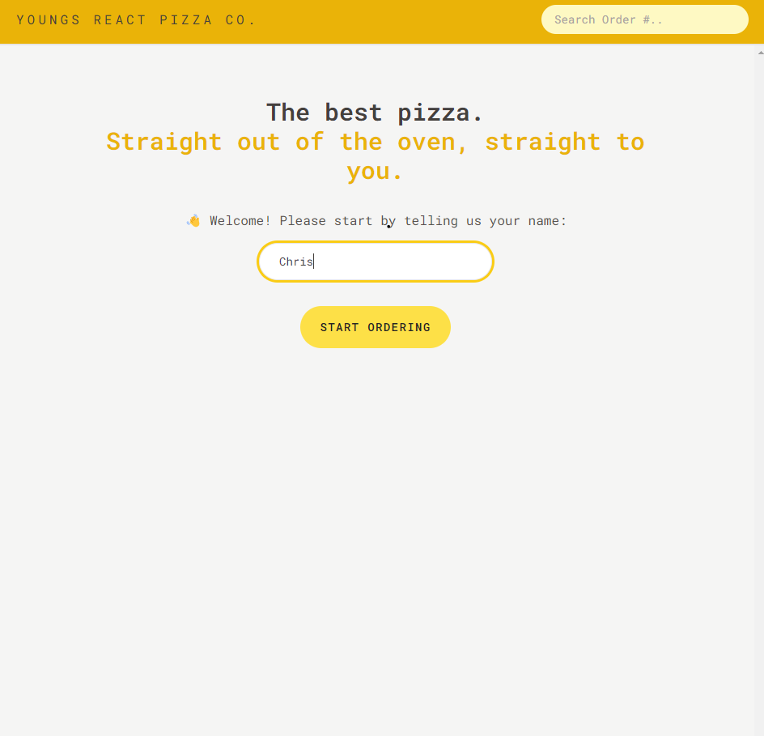
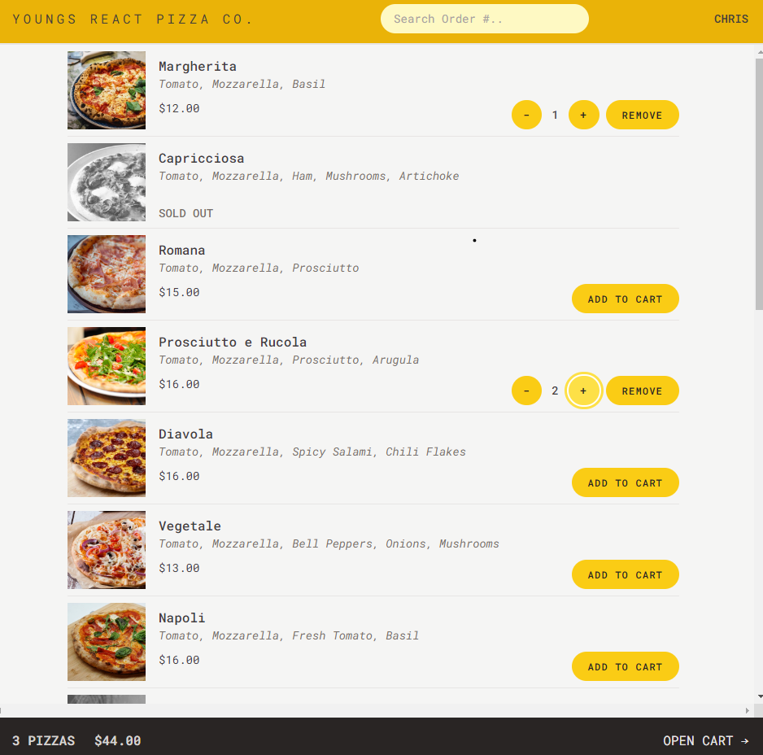
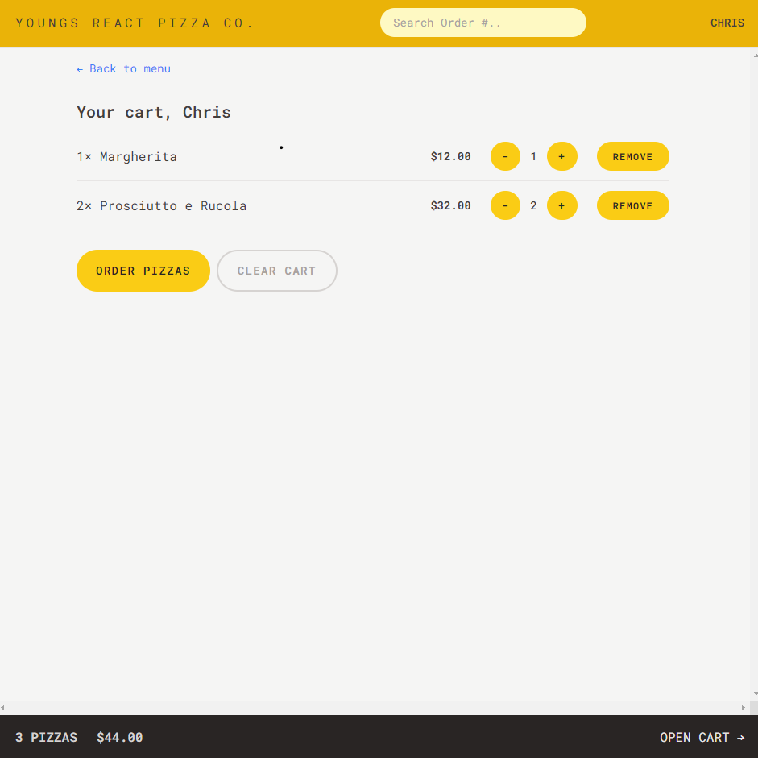
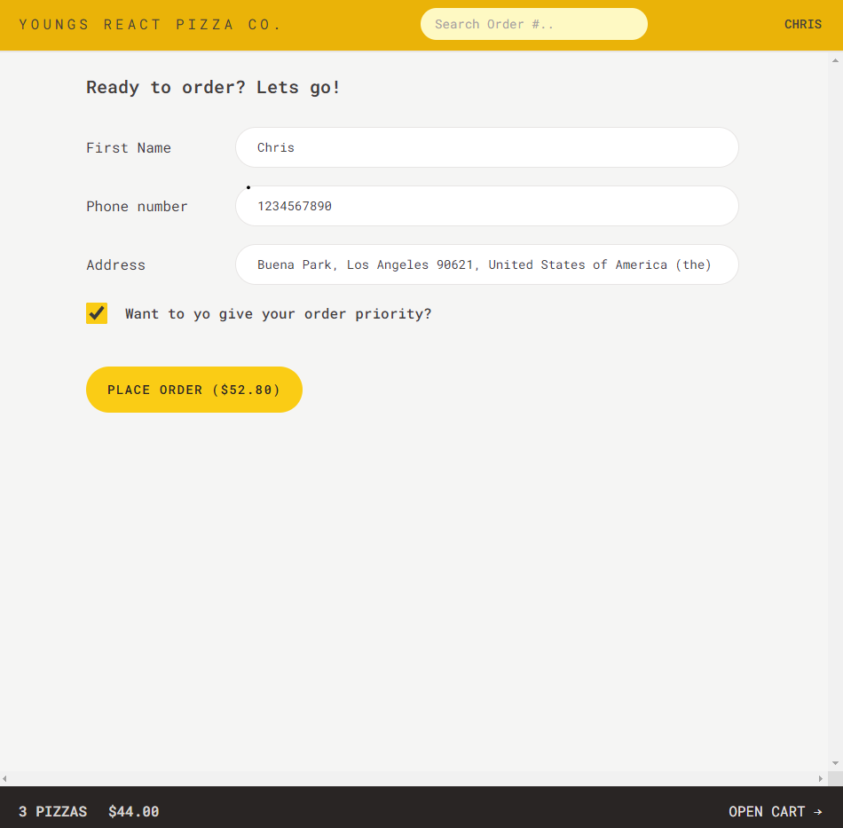
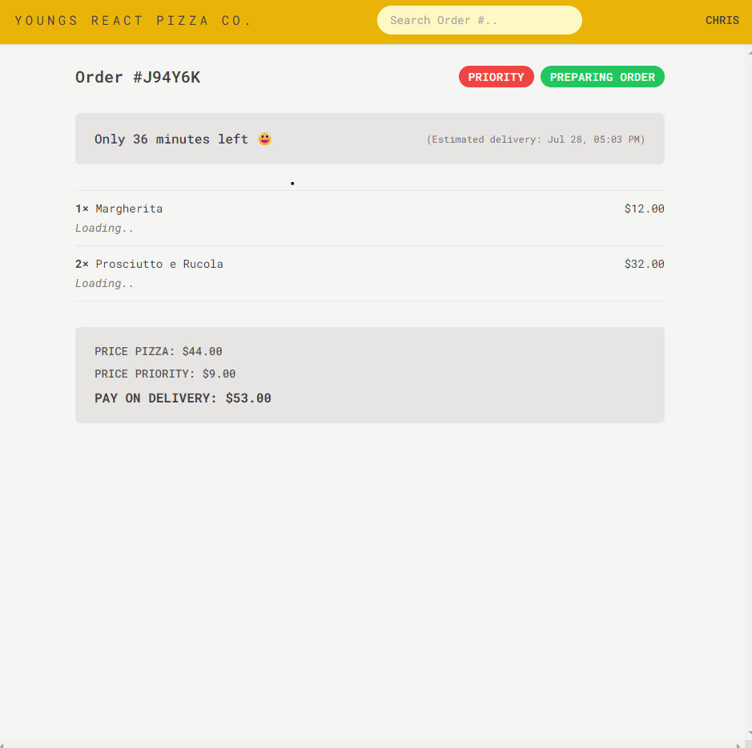

 

---

# React Pizza Co. (Practice Project)

## Description







This practice application has been created to practice advanced React concepts such as: React Hooks, custom React Hooks, React Router, Redux, Redux Toolkit, Global State using Url, modern React file structure (slices) and more.. It is compiled using Vite.

This application started with planning/structuring the whole project from the scratch. The following steps were taken to get things started:

- 1. Gather application requirements and features
- 2. Divide the application into pages
- 3. Divide the application into feature categories/slices
- 4. Decide what technologies to use

You can view more details on structuring this application in PLAN.md file.

This application allows users to see a pizza menu, add/delete pizza items in their cart, update cart, delete cart, place order, search order, update order and finally make their orders priority. It also grabs user's address and prefills the form using reverse-geolocation technology. Note: canceling order feature isn't available in this version.

Please check out installation section on this README before running the application.

---

## Table of Contents

- [Installation](#installation)
- [Usage](#usage)
- [Credits](#credits)
- [Contributing](#contributing)
- [Tests](#tests)
- [Questions](#questions)

---

## Installation

You will have to run this program in your terminal.

To install necessary dependencies, run the following command:

```bash
npm i
```

---

## Usage

Once after you've installed dependencies, run the application with the following command in your terminal:

```bash
npm run dev
```

If you've followed the steps correctly, you will be able to use the application by opening a browser and going to http://localhost:5173

This application fetches data from a live server. Please make sure you have a good internet connection!

---

## Credits

Thank you, Jonas Schmedtmann, for Tailwind styling guides, design principles, reuseable React components, React and React Toolkit guides and instructions!

---

## Contributing

For contributions, please create a new branch of the project and submit a pull request. Any contributions are greatly appreciated. Issues can be submitted in the issues section of the repo or by emailing me directly (see Questions section below).

---

## Tests

Test feature is not available at this time.

---

## Questions

If you have any questions about the repo, open an issue or contact me directly at:

Github: [jyoungjoon](https://github.com/jyoungjoon)

Email: lifescriptified@gmail.com

---
